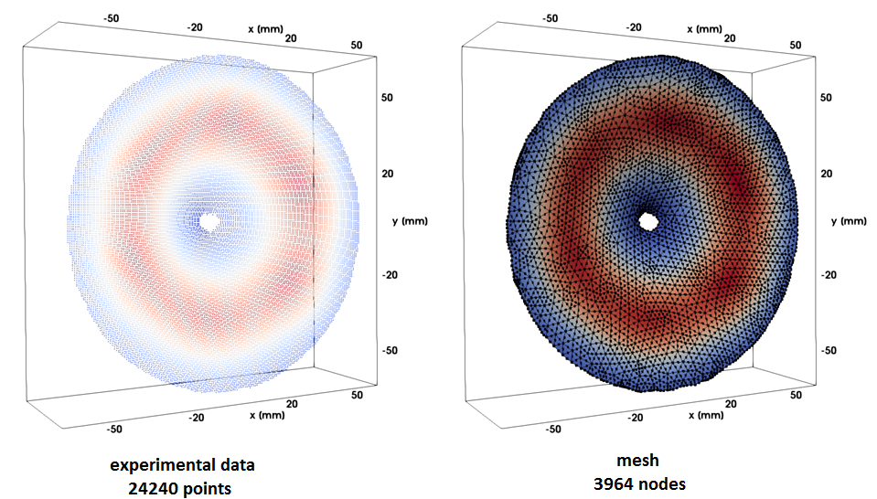

# Summary

This piece of code is a single step of the procedure shown in [1]. Here, the user should have a data that he wishes to interpolate on an irregular Finite-Element-Method mesh. The former must be coupled with the spatial coordinates x, y & z (as it can be seen in the file “experimentalData.txt”). Furthermore, a customized GMSH mesh made of quadratic triangles should overlap the spatial point cloud shown in “experimentalData.txt”. This file is called “quadraticMesh.msh” in this example.
The inputs & outputs of the code can be seen next:

The first figure shows the point cloud representing the measured surface & their colors correspond to the data’s magnitude linked to them. The figure on the right is the customized Finite-Element-Method mesh containing the interpolated experimental data.
[1]: Pires, F., Avril, S., Vanlanduit, S., & Dirckx, J. (2019). Structural intensity assessment on shells via a finite element approximation. The Journal of the Acoustical Society of America, 145(1), 312-326.

